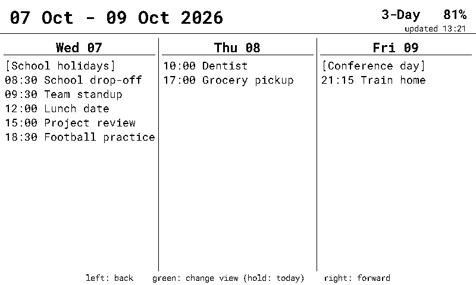
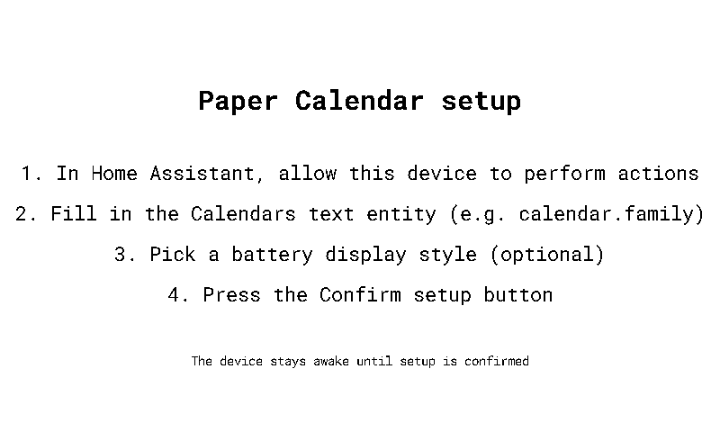

# Paper Calendar

A battery powered Home Assistant calendar for e-paper displays, built with [ESPHome](https://esphome.io).

The device fetches your Home Assistant calendar events with the `calendar.get_events` action, draws them in a day or 3-day view, and then deep-sleeps until the next refresh or button press, so a single charge lasts a long time.


## Supported devices

| Device                                                                                    | Chip     | Config                               |
|-------------------------------------------------------------------------------------------|----------|--------------------------------------|
| [Seeed Studio reTerminal E1001](https://www.seeedstudio.com/reTerminal-E1001-p-6534.html) | ESP32-S3 | [reterminal-e1001](reterminal-e1001) |

Each supported device has its own folder with its own prebuilt firmware, installable from the [web installer](https://jesserockz.github.io/paper-calendar/). All devices run the same firmware name (`paper-calendar`) and share the same rendering and features.

## Features

- Day and 3-day views of any number of Home Assistant calendars, merged and sorted.
- Deep sleep between refreshes with a configurable interval, awake time, and an overnight downtime window.
- Buttons wake the device *and* perform their action: page through the days or switch the view. A short beep confirms the press registered, since e-paper takes a few seconds to redraw.
- All-day events, word-wrap or truncation for long titles, an ignore list for events you do not want shown, 12/24-hour clock, and a battery readout (percentage, voltage, or both) in the header.
- Everything is configured through entities on the device itself - no Home Assistant helpers, template sensors, or YAML edits needed.



## Installation

Open the [web installer](https://jesserockz.github.io/paper-calendar/) in Chrome or Edge, plug the device in via USB, and click the install button for your device. The same flow lets you provision your Wi-Fi credentials over USB (via [Improv Serial](https://www.improv-wifi.com/)). If you skip that, the device opens a `paper-calendar` fallback hotspot you can connect to and configure Wi-Fi through.

No credentials are baked into the firmware: Home Assistant provisions the API encryption key automatically when the device is adopted, and every unit gets a unique hostname (a MAC address suffix).

## First-boot setup

The device stays awake until setup is confirmed, so there is no race against deep sleep:



1. Home Assistant discovers the device - add it via the **ESPHome** integration.
2. On the device page, press **Configure** and tick **Allow the device to perform Home Assistant actions** (the device calls `calendar.get_events`, which needs this).
3. Fill in the **Calendars** text entity with a comma separated list of calendar entity ids, e.g. `calendar.family, calendar.work`.
4. Optionally adjust the other options below.
5. Press the **Confirm setup** button. The display refreshes and the device starts its normal sleep cycle.

## Configuration entities

All of these live on the device and persist across deep sleep and reboots:

| Entity               | Type   | What it does                                                                                                                                                                            |
|----------------------|--------|-----------------------------------------------------------------------------------------------------------------------------------------------------------------------------------------|
| Calendars            | Text   | Comma separated calendar entity ids to show, e.g. `calendar.family, calendar.work`.                                                                                                     |
| Ignored events       | Text   | Comma separated event titles to hide, matched case-insensitively against the full title, e.g. `Out of office, Lunch`.                                                                   |
| Long event names     | Select | `Truncate` cuts long titles with `~`; `Word wrap` wraps them onto up to three lines at word boundaries.                                                                                 |
| Battery display      | Select | Header battery readout: `Percentage`, `Voltage`, or `Both`.                                                                                                                             |
| Refresh interval     | Number | Minutes asleep between display refreshes (5 to 720).                                                                                                                                    |
| Awake time           | Number | Seconds the device stays awake after boot or the last button press (10 to 300).                                                                                                         |
| 12-hour time         | Switch | Show times as `6:30pm` instead of `18:30`.                                                                                                                                              |
| Downtime start / end | Time   | Refresh wakes that would land inside this window are deferred to its end, e.g. 22:00 to 06:30 stops overnight refreshes. Buttons still wake the device. Equal times disable the window. |
| Prevent sleep        | Switch | Keeps the device awake, e.g. while you install an OTA update.                                                                                                                           |
| Confirm setup        | Button | Finishes first-boot setup; the device refuses to sleep until this has been pressed (and Calendars is filled in).                                                                        |

The device also exposes **Battery** (%), **Battery voltage**, an **Awake** binary sensor (Home Assistant keeps the last state while the device sleeps instead of marking it unavailable), and - on the factory firmware - a **Firmware** update entity that offers new releases from this repository.

## Buttons

On the reTerminal E1001, the three top buttons are:

| Button | Press   | Action                                                                              |
|--------|---------|-------------------------------------------------------------------------------------|
| Left   | Short   | Page one view back (1 or 3 days, depending on the view).                            |
| Right  | Short   | Page one view forward.                                                              |
| Green  | Short   | Cycle the view: day <-> 3-day.                                                      |
| Green  | Hold 1s | Jump back to today (only while the device is awake; a wake always starts on today). |

Any button also wakes the device from deep sleep, and the wake press performs its normal action (paging starts from today; the green hold-for-today only works while already awake).

## Updates

The factory firmware checks this repository's GitHub releases and exposes a **Firmware** update entity in Home Assistant. Because the device sleeps most of the time, the easiest way to update is: turn on **Prevent sleep** (or press a button to wake it), install the update from the update entity, then turn **Prevent sleep** back off.

If you have adopted the device into your own ESPHome dashboard, you update it from there instead, like any other ESPHome device.

## Using this config as a package

### Adopting into the ESPHome dashboard

The factory firmware advertises the device's core config (e.g. [reterminal-e1001/reterminal-e1001.yaml](reterminal-e1001/reterminal-e1001.yaml)) for adoption. Adopting creates a local config in your dashboard that imports this repository as a package, with your own Wi-Fi secrets and API key on top, and without the installer-only extras from the `.factory.yaml` wrapper.

### Personal overlay with fixed credentials

For a fully pinned build (fixed Wi-Fi, fixed API key, plain hostname), include the core config as a package and add your credentials on top:

```yaml
# my-paper-calendar.yaml
packages:
  paper_calendar: github://jesserockz/paper-calendar/reterminal-e1001/reterminal-e1001.yaml@main

esphome:
  # One personal device: keep the plain hostname
  name_add_mac_suffix: false

wifi:
  ssid: !secret wifi_ssid
  password: !secret wifi_password
  # Connect straight to the stored AP instead of scanning first - faster
  # wake-to-refresh, which matters on battery.
  fast_connect: true

api:
  encryption:
    key: !secret api_encryption_key
```

## Development

The configuration is plain ESPHome YAML (requires ESPHome 2026.9.0 or newer), laid out per device:

- `<device>/<device>.yaml` - the complete device config (what gets adopted), e.g. [reterminal-e1001/reterminal-e1001.yaml](reterminal-e1001/reterminal-e1001.yaml). Every device uses the firmware name `paper-calendar`.
- `<device>/<device>.factory.yaml` - the web-installer image for that device: the core config plus Improv Serial provisioning, dashboard import, and GitHub-release OTA updates.
- [common/](common) - the render lambda and fonts shared by every device config and the screenshot tool.
- [screenshots/screenshots.yaml](screenshots/screenshots.yaml) - a host-platform config that renders the display with demo events and saves the screenshots used on this page (`esphome run screenshots/screenshots.yaml`, then convert the BMPs from `screenshots/.esphome/snapshots/` to PNG in `static/screenshots/`).

```bash
esphome compile reterminal-e1001/reterminal-e1001.factory.yaml
```

Releases are built automatically: pushes to `main` update a draft release via Release Drafter, the Build workflow builds every device group listed in [.github/workflows/build.yml](.github/workflows/build.yml) and attaches one manifest per device, and publishing the release deploys the [installer site](https://jesserockz.github.io/paper-calendar/).
