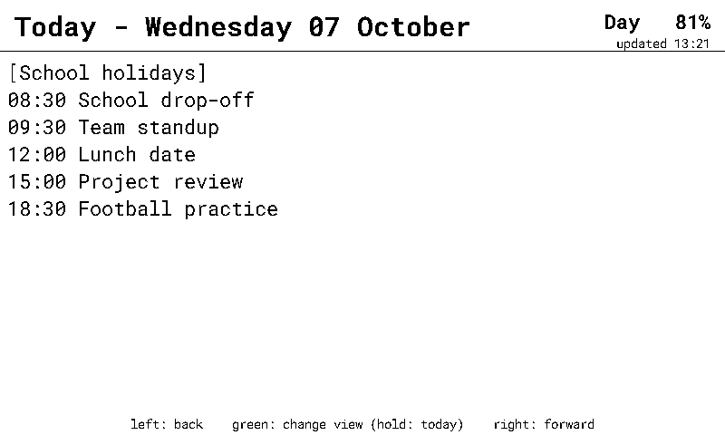

# About

Paper Calendar turns an e-paper display into a battery powered calendar for Home Assistant.

- Shows your Home Assistant calendars in a day or 3-day view.
- Runs on battery for weeks: the device deep-sleeps between refreshes and wakes on a button press.
- Buttons page through the days and switch the view (hold to jump back to today).
- Everything is configured from Home Assistant through entities on the device itself - calendars, refresh interval, downtime window, 12/24-hour clock and more. No helpers or YAML edits needed.

See the [README](https://github.com/jesserockz/paper-calendar) for the full feature list and setup guide.

# Installation

Pick your device below to install the pre-built firmware via USB from the browser. The installer also lets you provision Wi-Fi credentials over the same USB connection.

## Seeed Studio reTerminal E1001

<esp-web-install-button manifest="firmware/reterminal-e1001.manifest.json"></esp-web-install-button>

# After installing

1. Home Assistant discovers the device automatically - add it via the ESPHome integration.
2. Open the device page, press **Configure** and tick **Allow the device to perform Home Assistant actions**.
3. Fill in the **Calendars** text entity with a comma separated list of calendar entity ids (e.g. `calendar.family, calendar.work`).
4. Adjust any other options, then press **Confirm setup**. The device then starts its battery saving sleep cycle.
